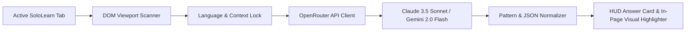

# 🤖 SoloLearn AI Companion

  
  
  
  

An intelligent, heart-safe **AI Study Companion & In-Page Solution Guide** for [SoloLearn](https://www.sololearn.com/en/learn) interactive courses, quizzes, code challenges, and fill-in-the-blank activities. 

Powered by frontier AI models (**Anthropic Claude 3.5 Sonnet**, **Google Gemini 2.0 Flash**, and **Gemini 1.5 Pro**) via the **OpenRouter API**, the companion dynamically scans your screen, computes flawless compiler-level solutions, and visually highlights answers directly on your webpage with step-by-step explanations.

---

## 👨‍💻 Created By

**Julian Agustino**
- GitHub: [@JulianAgustino](https://github.com/JulianAgustino)
- Project Repository: [SoloLearn AI Companion](https://github.com/JulianAgustino)

---

## 🌟 Key Features

| Feature | Description |
| :--- | :--- |
| **🏆 Frontier AI Models** | Pre-configured with **Claude 3.5 Sonnet** (highest coding IQ) and **Gemini 2.0 Flash** (ultra-fast syntax solver). |
| **🌐 Course Language Auto-Detection** | Automatically identifies active course languages (**C#**, **Python**, **JavaScript**, **Java**, **C++**, **SQL**, **HTML/CSS**) to eliminate syntax mix-ups. |
| **🎯 In-Page Visual Highlighter** | Injects glowing emerald badges (`🎯 CORRECT ANSWER`), step orders (`[1]`, `[2]`, `[3]`), and input placeholders directly onto SoloLearn cards. |
| **💡 Clear Reasoning & Proof** | Displays clean answer tokens in the HUD with a separate **`💡 Why:`** plain-English explanation and a **`🔍 View Scanned Context & Proof`** inspector. |
| **🛡️ 100% Heart-Safe & Anti-Bot Immune** | Acts as an augmented reality visual overlay. You stay in complete control of clicking and submitting, preventing heart loss and anti-bot bans. |
| **🔒 Zero-Leak Local Privacy** | **No API keys are hardcoded.** Your OpenRouter API key is stored exclusively in your browser's private local storage (`localStorage`). |

---

## ⚙️ How It Works (Architecture)

1. **Active Viewport Scanning**: When you press **`Alt + S`** (or with **Auto-Scan ON**), the script reads the visible exercise container, ignoring hidden SPA slides.
2. **Context & Language Locking**: Extracts course breadcrumbs, code blocks, blank slots (`[BLANK_1]`, `[BLANK_2]`), and word bank chips into an isolated compiler schema.
3. **Deterministic Query (0.0 Temperature)**: Sends the exercise to OpenRouter with mental dry-run instructions to evaluate operators (`+=`, `%=`), loops (`while`, `for`), and variable data types.
4. **Visual Highlight & Answer Isolation**:
   - The **Big Answer Box** displays strictly the pure answer tokens (e.g., `while, +=, x` or `true`).
   - The **`💡 Why:`** section displays the educational explanation.
   - The web page highlights the exact choice cards with a glowing outline.

---

## 🛠️ Quick Installation Guide

You can run this project either as a **Tampermonkey Userscript** (recommended for all browsers) or as a **Chrome Extension (Manifest V3)**.

### 🐒 Option 1: Tampermonkey Userscript (Recommended)

1. Install the [Tampermonkey](https://www.tampermonkey.net/) (or [Violentmonkey](https://violentmonkey.github.io/)) extension in your browser (Chrome, Edge, Brave, Firefox, Opera).
2. Click the Tampermonkey extension icon and select **Create a new script...**.
3. Open [`sololearn-ai-solver.user.js`](./sololearn-ai-solver.user.js) from this repository, copy all the code, and paste it into the Tampermonkey editor.
4. Save the script (**`Ctrl + S`**).
5. Open [SoloLearn Learn](https://www.sololearn.com/en/learn) — the floating companion panel will appear in the top-right corner!

### 📦 Option 2: Chrome Extension (Manifest V3)

1. Open your Chromium browser and go to `chrome://extensions` in your address bar.
2. Turn on **Developer mode** (toggle in the top-right corner).
3. Click **Load unpacked** (top-left button).
4. Select the root folder of this project.
5. Navigate to [SoloLearn](https://www.sololearn.com/en/learn) to use the extension.

---

## 🔑 OpenRouter Setup & Guardrail Configuration

To power the AI Companion, you need an [OpenRouter.ai](https://openrouter.ai/) API key. Follow this step-by-step guide to create your account, fund credits, and configure privacy guardrails:

### 1. Create an OpenRouter Account
1. Visit [OpenRouter.ai](https://openrouter.ai/) and click **Sign In** (using Google, GitHub, or email).
2. Go to the [Credits page](https://openrouter.ai/credits) to add credits ($2 to $5 can solve thousands of exercises).

### 2. Generate an API Key
1. Go to [OpenRouter Keys](https://openrouter.ai/keys).
2. Click **Create Key**.
3. Name your key (e.g. `SoloLearn Companion`) and click **Create**.
4. Copy your key (`sk-or-v1-...`).

### 3. Configure Privacy Guardrails & Zero Data Retention (ZDR)
OpenRouter provides built-in privacy guardrails to protect your data and control routing:

1. Navigate to [OpenRouter Privacy & Settings](https://openrouter.ai/settings/preferences).
2. **Data Retention Policy**:
   - If you require strict enterprise privacy, you can enable **Zero Data Retention (ZDR)**.
   - *Note*: If ZDR is enabled, OpenRouter routes Anthropic requests through Amazon Bedrock or Google Vertex AI.
3. **Credit Limits**:
   - Set a **Monthly Limit** or **Credit Cap** on your API key (e.g., $5/month) on the [Keys page](https://openrouter.ai/keys) to prevent accidental overspending.
4. **Content Filtering / Guardrails**:
   - In Settings, configure moderation filters and provider fallbacks according to your preferences.

### 4. Input Your Key into the Companion
1. Open any lesson on [SoloLearn](https://www.sololearn.com/en/learn).
2. On the floating **SoloLearn AI Companion** panel, paste your key into the prompt box and click **Save** (or open **⚙ Settings**).
3. Select your model:
   - **`Claude 3.5 Sonnet`** (Recommended default for flawless syntax)
   - **`Gemini 2.0 Flash`** (Ultra-fast)
   - **`Gemini 1.5 Pro`** (Deep multi-step reasoning)

---

## 🎮 How to Use

1. Navigate to any SoloLearn course exercise (C#, Python, JavaScript, Java, C++, etc.).
2. Press **`Alt + S`** on your keyboard (or click **🔍 Scan & Reveal Answer** on the HUD).
3. The companion will:
   - Reveal the exact answer token(s) in the green HUD box.
   - Show a step-by-step educational explanation in the **`💡 Why:`** box.
   - Visually highlight the target choice card or place numbered badges on word chips.
4. *(Optional)* Toggle **Auto-Scan on Question Change** to **ON** for automatic answer detection whenever a new question loads!

---

## 🛡️ Security & Privacy Guarantee

- **No Hardcoded Secrets**: This repository contains zero hardcoded API keys or personal tokens.
- **Client-Side Storage**: Your OpenRouter API key is stored strictly on your local machine using browser-isolated storage (`localStorage` / `chrome.storage.local`).
- **Direct Encrypted Calls**: All queries travel directly from your browser to OpenRouter's official API endpoint over TLS/HTTPS.

---

## 📜 License

This project is licensed under the **MIT License** — see the [LICENSE](LICENSE) file for details.

### ⚠️ Disclaimer
*This project is an educational study companion designed to aid in learning programming concepts, syntax verification, and debugging. Please use this tool responsibly and adhere to all platform terms of service.*
