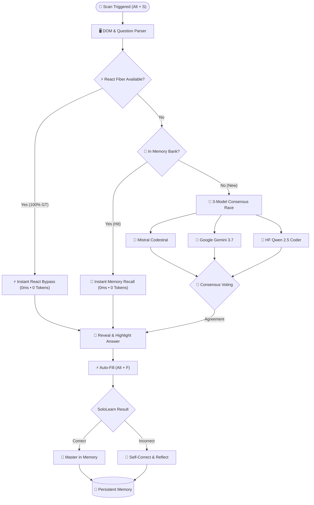

# 🤖 SoloLearn AI Companion

  
  
  
  
  
  
  

A fast, high-precision **Multi-AI Solver & Study Companion** for [SoloLearn](https://www.sololearn.com/en/learn). Automatically handles single-choice, multi-select checkboxes, fill-in-the-blanks, drag-and-drop code reordering, and diagram/table analysis.

Powered by **Mistral Codestral**, **Google Gemini 3.7 Flash**, and **Qwen 2.5 Coder 32B** with **3-Model Consensus Voting**, **Persistent Memory**, and **React Ground-Truth Bypass**.

---

## 👨‍💻 Created By

**Julian Agustino** ([@REP-Julian](https://github.com/REP-Julian)) • [Repository](https://github.com/REP-Julian/sololearn-ai-companion)

---

## ⚖️ Pros & Cons

### 🟢 Pros
* **🏁 3-Model Consensus Race**: Races 3 distinct AI models simultaneously. Zero single-model hallucinations.
* **🧠 Adaptive Memory (0ms / 0 Tokens)**: Saves verified solutions to local storage for instant zero-token recall.
* **🔄 Self-Correction & Learning**: Analyzes mistakes post-submission and adapts memory permanently.
* **⚡ React Fiber Ground Truth**: Traverses React 18/19 internal state for 100% instant ground truth when available.
* **👁️ SVG & Diagram Analysis**: Extracts visual tables and illustrations (e.g. SQL `GROUP BY` / `HAVING`).
* **☑️ Multi-Select Support**: Automatically checks all correct answers on multi-choice questions.
* **⚡ One-Click Auto-Fill (`Alt + F`)**: Instantly fills inputs and selects checkboxes with synthetic React events.
* **🔒 100% Client-Side Privacy**: Runs purely in-browser. No proxy servers, no telemetry, local key storage.
* **💸 100% Free**: Uses free-tier API keys from Google AI Studio, Mistral, and Hugging Face.

### 🔴 Cons
* **🔑 Requires 1+ API Key**: Needs at least 1 free API key for new questions not yet in memory.
* **📶 Internet Speed Dependency**: Slow or unstable internet delays question loading and cloud AI query responses.
* **⏱️ Free-Tier Rate Limits**: Rapid mass-solving without action delays can trigger provider rate limits (e.g. 15 RPM).
* **🌐 Extension Prerequisite**: Requires Tampermonkey/Violentmonkey or loading unpacked in Chrome.

---

## 📈 Accuracy & Token Consumption Matrix

| Configuration Mode | Accuracy | Consensus Confidence | Token Burn Rate |
| :--- | :---: | :---: | :---: |
| **⚡ React Ground Truth / 🧠 Memory** | **100%** | **Deterministic (Golden)** | **0 Tokens** *(0ms)* |
| **🏆 3 AI Providers** *(Mistral + Google + HF)* | **~80% – 95%** | **3/3 Unanimous / 2/3 Majority** | **Balanced** *(1 call per key)* |
| **🔄 1 AI Provider + 3-Model Expansion** | **~60% – 75%** | **Internal Intra-Provider** | **3× Token Burn** *(On 1 key)* |
| **🥈 2 AI Providers** *(e.g. Mistral + Google)* | **~50% – 65%** | **Dual-Model Race + Fallback** | **Moderate** |
| **🥉 1 AI Provider (Single Model)** | **~35% – 45%** | **No Second Opinion** | **Low** *(1 call)* |

> **Key Rule**: 3 providers = **80%+ accuracy** with distributed free quota. 1 provider with 3-model expansion = **60% accuracy** but consumes **3× tokens**.

---

## ⚙️ Architecture & Solving Flow

---

## 🛠️ Quick Installation

### Option 1: Tampermonkey Userscript (Recommended)
1. Install [Tampermonkey](https://www.tampermonkey.net/) or [Violentmonkey](https://violentmonkey.github.io/).
2. Create a new script, copy & paste [`sololearn-ai-solver.user.js`](./sololearn-ai-solver.user.js), and save (**`Ctrl + S`**).
3. Open [SoloLearn](https://www.sololearn.com/en/learn) — the companion HUD appears top-right!

### Option 2: Chrome Extension (Manifest V3)
1. Go to `chrome://extensions` and enable **Developer mode**.
2. Click **Load unpacked** and select this repository folder.

---

## 🔑 Free API Key Setup (1 Minute)

Open Companion Settings (**⚙**) and paste your free key(s):

| Provider | Model | Free Tier Setup Link |
| :--- | :--- | :--- |
| **Google AI Studio** | `gemini-3.7-flash` | [aistudio.google.com](https://aistudio.google.com/) ➔ **Get API key** *(Free, 15 RPM)* |
| **Mistral AI** | `codestral-latest` | [console.mistral.ai](https://console.mistral.ai/) ➔ **API Keys** *(Free Experiment Tier)* |
| **Hugging Face** | `Qwen/Qwen2.5-Coder-32B-Instruct` | [huggingface.co/settings/tokens](https://huggingface.co/settings/tokens) ➔ **Create Read Token** *(Free)* |

---

## 🎮 Keyboard Shortcuts & Controls

| Shortcut | Action | Description |
| :--- | :--- | :--- |
| **`Alt + S`** | **🔍 Scan & Reveal** | Scans question, queries consensus / memory, and highlights the answer. |
| **`Alt + F`** | **⚡ Auto-Fill** | Selects correct choices, checks boxes, and fills blanks automatically. |
| **`Alt + C`** | **📋 Copy Answer** | Copies the answer text directly to your clipboard. |
| **`👍 Learned`** | **Confirm Memory** | Manually masters the answer in persistent memory. |
| **`👎 Correct Me`** | **Self-Correction** | Teaches the AI the right answer to adapt its memory instantly. |
| **⚡ Auto-Scan** | **HUD Toggle** | Automatically scans and reveals answers as questions change. |

---

## 📜 License & Disclaimer

MIT License • Copyright (c) 2025 Julian Agustino (@REP-Julian).  
*Educational study tool for learning and debugging. Use responsibly.*
