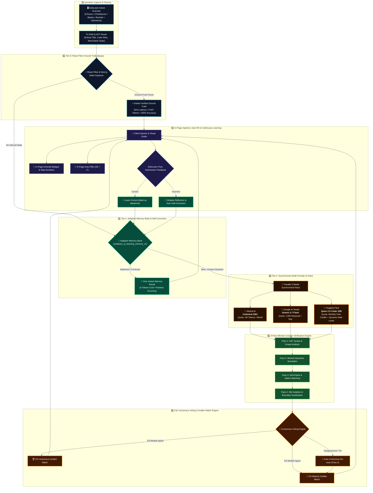

# 🤖 SoloLearn AI Companion (Multi-Provider AI & Adaptive Learning)

  
  
  
  
  
  
  

An intelligent, high-precision **Multi-Provider AI Study Companion & Automation Solver** for [SoloLearn](https://www.sololearn.com/en/learn) interactive courses, quizzes, code challenges, fill-in-the-blanks, drag-and-drop code reordering, and multi-select questions.

Powered concurrently by **Mistral AI (Codestral)**, **Google AI Studio (Gemini 3.7 / 2.5 Flash)**, and **Hugging Face (Qwen 2.5 Coder 32B)** with **Continuous Adaptive Learning & Self-Correction**, client-side **React Fiber Ground-Truth Inspection**, and a **4-Pass Mental Compiler Verification Protocol**.

---

## 👨‍💻 Created By

**Julian Agustino**
- GitHub: [@REP-Julian](https://github.com/REP-Julian)
- Project Repository: [SoloLearn AI Companion](https://github.com/REP-Julian/sololearn-ai-companion)

---

## 🌟 Key Features Summary

| Feature | Description |
| :--- | :--- |
| **🧠 Continuous Adaptive Learning** | Automatically saves verified solutions into persistent memory (`sololearn_ai_learning_memory_v1`) for **instant 0ms, zero-token recall** on future encounters. |
| **🔄 Self-Correction & Reflection** | Detects wrong answers, analyzes errors, formulates explicit **Mistake Reflections**, and permanently adapts memory so errors are **never repeated**. |
| **🏁 3-Model Consensus Race** | Synchronously races **Mistral Codestral**, **Google AI Studio Gemini**, and **Hugging Face Qwen Coder** to achieve Unanimous (3/3) or Majority (2/3) golden consensus. |
| **☑️ Multi-Select & Checkbox Support** | Automatically identifies checkbox cards and *"Select all correct answers"* instructions to select and auto-fill all matching options (e.g. SQL LIKE patterns). |
| **⚡ React Ground Truth Bypass** | Traverses client-side React Fiber nodes and Hooks linked lists for 100% ground truth with **0 API tokens and 0ms latency**. |
| **🧩 Drag-and-Drop Sequencing** | Automatically numbers draggable code blocks (`Step 1`, `Step 2`, `Step 3`...) on the SoloLearn webpage in visual order. |
| **⚡ In-Page Auto-Filler (`Alt + F`)** | Automatically selects choices, checks all checkboxes, and populates blank input slots with synthetic React event triggers. |
| **🌐 Multi-Language Auto-Detection** | Detects active courses: **Python**, **C# (.NET)**, **JavaScript**, **Java**, **C++**, **SQL**, **HTML/CSS**, and **Conceptual Definitions**. |
| **🎯 In-Page Visual Highlighter** | Injects glowing emerald borders (`🎯 Correct Answer`), amber correction cards, and slot placeholders into page elements. |
| **💡 Multi-AI Trace & Proof** | Click `▶ 🔍 View Multi-AI Trace & Proof` to inspect reasoning, compiler AST passes, and vote distributions. |
| **🔒 100% Client-Side Privacy** | API keys are stored exclusively in local browser storage (`localStorage` / `chrome.storage.local`). Zero telemetry or external servers. |

---

## ⚙️ Architecture & Solving Flow (Graphic Blueprint)

---

## 📊 Free Tier Quotas & Token Limits (Provider Comparison)

Here is the breakdown of the free tier allowances, rate limits, and token caps across all supported AI providers:

| Provider | Free Tier Quota / Allowance | Rate Limits (RPM / RPD / TPM) | Reset Cycle | Default Recommended Model | Key Strengths & Specialty | Cost |
| :--- | :--- | :--- | :--- | :--- | :--- | :--- |
| **Mistral AI** | **1,000,000 (1M) Tokens / Month** | 1 req/sec | Monthly Account Billing Cycle | `codestral-latest` (Codestral 2501) | Dedicated 80+ programming languages, Fill-in-the-Middle (FIM), exact compiler tokens. | **$0.00** |
| **Google AI Studio** | **1,500 Requests / Day** (~1.5M–3.0M+ Tokens/Day) | 15 RPM • 1,000,000 TPM • 1,500 RPD | Daily at **00:00 UTC** *(Live countdown in HUD)* | `gemini-3.7-flash` | Ultra-fast reasoning, conceptual syntax definitions, complex logic puzzles. | **$0.00** |
| **Hugging Face** | **Free Monthly Credits ($0.10/mo) + Dynamic Rate Limit** | ~few hundred req/hr (~30-60 req/min depending on cluster demand) | Monthly Credit Refresh Cycle | `Qwen/Qwen2.5-Coder-32B-Instruct` | State-of-the-art open-weights coding models on free Serverless Inference. | **$0.00** |

---

### 🔍 In-Depth Breakdown: How Each Provider's Quota Works

#### 1️⃣ Mistral AI — *1,000,000 Free Tokens / Month*
* **Quota Allocation**: Mistral AI provides **1M free tokens per month** on free tier developer accounts at [console.mistral.ai](https://console.mistral.ai/).
* **Typical Consumption**: Each SoloLearn question prompt + response consumes approximately **150 to 350 tokens**.
* **Capacity**: 1,000,000 tokens translates to approximately **~3,000 to 6,500 SoloLearn questions per month** completely free.
* **Automatic Fallback**: If `codestral-latest` is temporarily rate-limited, the companion automatically rotates across `mistral-small-latest`, `open-mistral-nemo`, `ministral-8b-latest`, and `mistral-large-latest`.

#### 2️⃣ Google AI Studio (Gemini) — *1,500 Free Requests / Day*
* **Quota Allocation**: Google AI Studio provides **1,500 Requests per Day (RPD)**, **15 Requests per Minute (RPM)**, and **1,000,000 Tokens per Minute (TPM)** on the free tier for Gemini Flash models.
* **Capacity**: Allows solving up to **1,500 SoloLearn questions every single day** with zero cost.
* **Reset Schedule**: Resets every 24 hours at **00:00 UTC**. The SoloLearn AI Companion HUD features a built-in countdown clock showing exact time remaining until the next UTC reset.
* **Automatic Fallback**: If a specific model reaches its rate limit, the companion automatically rotates across `gemini-3.7-flash`, `gemini-3.6-flash`, `gemini-3.5-flash-lite`, `gemini-3.1-flash-lite`, and `gemini-2.5-flash`.

#### 3️⃣ Hugging Face — *Serverless Inference Quota Model Identified*
* **How Hugging Face Quota Works**:
  * Hugging Face does **not** count a rigid token cap (e.g. 1M tokens) for its Serverless Inference API / Router (`router.huggingface.co`).
  * Instead, Hugging Face free accounts receive **Free Monthly Compute Credits (~$0.10/month free quota allocation)** combined with **Dynamic Concurrency & Rate Limiting** (~several hundred requests per hour / ~30–60 requests per minute based on serverless cluster load).
* **Model Context Window**: Up to the model's native context window (e.g. **32,768 tokens** for Qwen 2.5 Coder 32B).
* **HTTP Body Limit**: Maximum payload size of **2,000,000 bytes (~2 MB)**.
* **Cold Starts**: Shared serverless worker instances may experience a 10–30s cold start if a model has not been queried recently.
* **Automatic Multi-Model Fallback Chain**: If a rate limit (HTTP 429), out-of-credits (HTTP 402), or cold start occurs, the companion automatically rotates across:
  $$\text{Qwen 2.5 Coder 32B} \longrightarrow \text{Llama 3.3 70B Instruct} \longrightarrow \text{DeepSeek R1 Distill 32B} \longrightarrow \text{Mistral 7B Instruct}$$

---

## 🤖 Models & API Keys Architecture

### ❓ How Many API Keys Do I Need?

You can choose how many API keys you want to configure:

* **🚀 Minimum Setup (1 API Key)**:
  Configure any **ONE** provider (Mistral AI, Google AI Studio, OR Hugging Face). If you only enter 1 key, the engine automatically expands to race **3 distinct top models from that single provider** in parallel!
* **🏆 Recommended Golden Setup (3 API Keys)**:
  Configure **1 Mistral Key + 1 Google AI Studio Key + 1 Hugging Face Token**. This enables the **True Multi-Provider Consensus Race**, cross-validating Codestral vs Gemini vs Qwen Coder simultaneously!

---

### 📊 Supported Models Matrix

| Provider | Default / Recommended Model | Secondary / Fallback Models | Free Allowance | Best For |
| :--- | :--- | :--- | :--- | :--- |
| **Mistral AI** | `codestral-latest` (Codestral 2501) | `mistral-small-latest`, `open-mistral-nemo`, `ministral-8b-latest` | **1M Tokens / Month** | Dedicated 80+ programming language syntax, FIM completion. |
| **Google AI Studio** | `gemini-3.7-flash` | `gemini-3.6-flash`, `gemini-3.5-flash-lite`, `gemini-2.5-flash` | **1,500 Requests / Day** | Ultra-fast reasoning, conceptual definitions, complex logic. |
| **Hugging Face** | `Qwen/Qwen2.5-Coder-32B-Instruct` | `meta-llama/Llama-3.3-70B-Instruct`, `deepseek-ai/DeepSeek-R1-Distill-Qwen-32B` | **Free Serverless Credits** | SOTA open-weights coding models on free serverless inference. |

---

## 🔑 Step-by-Step API Key Setup Guides

### 1️⃣ Google AI Studio API Key (Gemini) — *Recommended & Free (1,500 Req/Day)*
Google AI Studio offers a free tier with 1,500 requests/day, 1M TPM, and cutting-edge Gemini 3.7 / 2.5 Flash models.

1. Go to [Google AI Studio](https://aistudio.google.com/).
2. Sign in with your Google account.
3. Click **Get API key** in the left navigation menu.
4. Click **Create API key** (create in a new or existing Google Cloud project).
5. Copy your API key (starts with `AIzaSy...`).
6. In SoloLearn, open the Companion Settings (**⚙**), paste into **Google AI Studio Key**, and click **Save Settings**.

---

### 2️⃣ Mistral AI API Key (Codestral) — *Free (1,000,000 Tokens/Month)*
Mistral AI provides 1M free tokens/month to access Codestral 2501, the flagship code specialist model.

1. Go to the [Mistral AI Console](https://console.mistral.ai/).
2. Sign in or create an account.
3. Navigate to **API Keys** in the left sidebar.
4. Click **Create new key**, name it `SoloLearn Companion`, and copy your key.
5. In SoloLearn, open the Companion Settings (**⚙**), paste into **Mistral AI Key**, and click **Save Settings**.

---

### 3️⃣ Hugging Face User Access Token (Qwen Coder) — *Free Serverless Inference*
Hugging Face allows querying top open-source coding models like Qwen 2.5 Coder 32B via free Serverless Inference credits.

1. Go to [Hugging Face Settings > Tokens](https://huggingface.co/settings/tokens).
2. Sign in or create a free Hugging Face account.
3. Click **Create new token**.
4. Set Token type to **Read** and name it `SoloLearn Companion`.
5. Click **Create token** and copy the generated token (starts with `hf_...`).
6. In SoloLearn, open the Companion Settings (**⚙**), paste into **Hugging Face Token**, and click **Save Settings**.

---

## 🛠️ Quick Installation Guide

You can run this project as a **Tampermonkey Userscript** (recommended for all browsers) or as an **Unpacked Chrome Extension (Manifest V3)**.

### 🐒 Option 1: Tampermonkey Userscript (Recommended)

1. Install the [Tampermonkey](https://www.tampermonkey.net/) (or [Violentmonkey](https://violentmonkey.github.io/)) extension in your browser.
2. Open the extension dashboard and select **Create a new script...**.
3. Open [`sololearn-ai-solver.user.js`](./sololearn-ai-solver.user.js) from this repository, copy all contents, and paste it into the editor.
4. Save the script (**`Ctrl + S`**).
5. Open [SoloLearn Learn](https://www.sololearn.com/en/learn) — the floating companion panel will appear in the top-right corner!

### 📦 Option 2: Chrome Extension (Manifest V3)

1. Open your Chromium browser and navigate to `chrome://extensions`.
2. Enable **Developer mode** (toggle in the top-right corner).
3. Click **Load unpacked** (top-left button).
4. Select the root folder of this repository.
5. Navigate to [SoloLearn](https://www.sololearn.com/en/learn) to use the extension.

---

## 🎮 How to Use & Keyboard Shortcuts

| Shortcut / Control | Action | Description |
| :--- | :--- | :--- |
| **`Alt + S`** | **🔍 Scan & Reveal** | Scans React Fiber state & DOM, queries Multi-AI consensus or memory bank, and displays the verified answer. |
| **`Alt + F`** | **⚡ Auto-Fill** | Automatically selects choices, checks all multi-select checkboxes, and populates blank slots on the page. |
| **`Alt + C`** | **📋 Copy Answer** | Copies the clean answer string directly to your clipboard. |
| **`👍 Learned (Correct)`** | **Confirm Memory** | Manually confirms the active answer and masters it in the Adaptive Memory Bank. |
| **`👎 Correct Me`** | **Mistake Correction** | Opens the self-correction drawer to teach the companion the correct answer for instant adaptation. |
| **⚡ Auto-Scan** | **Toggle on HUD** | Automatically scans and reveals solutions in real time as questions change. |

---

## 📢 Release v2.1.5 Highlights

### 🚀 What's New in Version 2.1.5:
* **🧠 Continuous Adaptive Learning & Self-Correction**:
  * Persistent storage under `sololearn_ai_learning_memory_v1`.
  * Instant **0ms latency, zero-token recall** for previously mastered questions.
  * Formulates explicit **Mistake Reflections** on incorrect answers to adapt memory and prevent repeated errors.
  * Pre-seeded with historical benchmark questions across Python, Java, C#, C++, SQL, JS, HTML/CSS, and definitions.
* **☑️ Multi-Select & Checkbox Support ("Select All Correct Answers")**:
  * Detects checkbox options (`<input type="checkbox">`, `[role="checkbox"]`, SVG checkbox icons, labels).
  * Comprehensive pattern-matching evaluation (e.g. SQL `LIKE 'The%King_'` selecting both matching choices).
  * In-page auto-fill checks all matching checkboxes simultaneously.
* **🏁 3-Provider Synchronized Consensus**:
  * Raced concurrently across **Mistral AI (Codestral)**, **Google AI Studio (Gemini 3.7 Flash)**, and **Hugging Face (Qwen 2.5 Coder 32B)**.
  * Unanimous 3/3 and Majority 2/3 golden matching with automatic consensus re-scan on disagreement.
  * Single-provider auto-expansion to 3 parallel internal models if only 1 key is provided.
* **🔄 Removed Deprecated Models**:
  * Cleaned out unstable third-party aggregators in favor of direct official API endpoints (`generativelanguage.googleapis.com`, `router.huggingface.co`, `api.mistral.ai`).
  * Upgraded default models to `gemini-3.7-flash` and `Qwen/Qwen2.5-Coder-32B-Instruct`.
* **🧪 29/29 Automated Tests Passed**: Complete test coverage across AST cleaning, React Fiber inspection, SQL multi-line auto-fill, memory adaptation, and multi-select checkboxes.

---

## 🛡️ Security & Privacy

- **Zero Hardcoded Secrets**: This repository contains zero hardcoded API keys or personal tokens.
- **Client-Side Encrypted Storage**: Your API keys and learned memories are stored strictly on your local device via browser-isolated storage (`localStorage` / `chrome.storage.local`).
- **Direct Encrypted Transport**: All API requests travel directly from your browser to official TLS/HTTPS endpoints (`api.mistral.ai`, `generativelanguage.googleapis.com`, `router.huggingface.co`).

---

## 📜 License

This project is licensed under the **MIT License** — see the [LICENSE](LICENSE) file for details.

### ⚠️ Disclaimer
*This project is an educational study companion designed to aid in learning programming concepts, syntax verification, and debugging. Please use this tool responsibly and adhere to all platform terms of service.*
