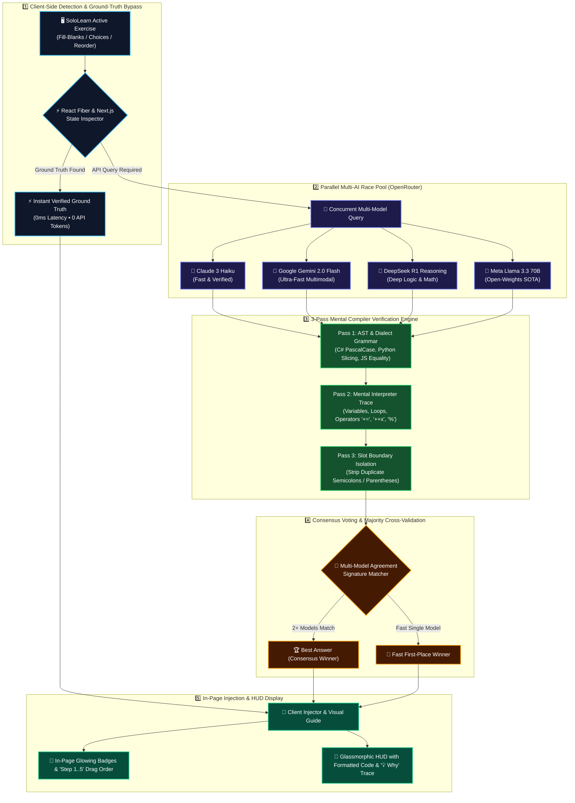

# 🤖 SoloLearn AI Companion

  
  
  
  
  

An intelligent, heart-safe, multi-model **AI Study Companion & In-Page Solution Guide** for [SoloLearn](https://www.sololearn.com/en/learn) interactive courses, quizzes, code challenges, fill-in-the-blanks, and code rearrange exercises.

Powered by a **Parallel Multi-AI Race & Majority-Vote Consensus Engine** via the **OpenRouter API** (featuring **Claude 3 Haiku**, **Google Gemini 2.0 Flash (Free)**, **DeepSeek R1 Reasoning (Free)**, **Llama 3.3 70B (Free)**, and **Mistral Small (Free)**), with client-side **React Fiber Ground-Truth Inspection** and a **3-Pass Mental Compiler Verification Protocol**.

---

## 👨‍💻 Created By

**Julian Agustino**
<<<<<<< HEAD
- GitHub: [@REP-Julian](https://github.com/REP-Julian)
- Project Repository: [SoloLearn AI Companion](https://github.com/REP-Julian/sololearn-ai-companion)

---

## 🌟 Key Features
=======

- GitHub: [@REP-Julian](https://github.com/REP-Julian)
- Project Repository: [SoloLearn AI Companion](https://github.com/REP-Julian/sololearn-ai-companion)

---

## 🌟 Key Features Summary
>>>>>>> db7488f9774b60950d8a161ef02e5fddcf754bd9

| Feature | Description |
| :--- | :--- |
| **🏆 Multi-AI Consensus Engine** | Runs multiple models in parallel; cross-validates and flags majority-agreed solutions as the verified Best Answer. |
| **⚡ React Ground Truth Bypass** | Reads client-side React Fiber nodes for 100% ground truth with 0 API tokens and 0ms latency. |
| **🧩 Drag-and-Drop Sequencing** | Automatically numbers draggable code blocks (`Step 1`, `Step 2`, `Step 3`...) on the SoloLearn webpage. |
| **🧠 3-Pass Compiler Verification** | Executes AST analysis, mental dry-run traces, and slot boundary checks before generating answers. |
| **🌐 Multi-Language Auto-Detection** | Detects active courses: **C# (.NET)**, **Python**, **JavaScript**, **Java**, **C++**, **SQL**, **HTML/CSS**. |
| **🎯 In-Page Visual Highlighter** | Injects glowing emerald borders, answer badges, and slot placeholders into page elements. |
| **💡 3-Pass Step-by-Step Proof** | Click `▶ 🔍 View 3-Pass Verification & Trace` to inspect mental compiler traces. |
| **🛡️ 100% Heart-Safe & Anti-Bot** | Visual overlay mode ensures you stay in control of clicking and submitting. |
| **🔒 Client-Side Key Privacy** | API keys are stored exclusively in local browser storage (`localStorage`). No keys are hardcoded. |

---

## ⚙️ Architecture & Solving Flow (Graphic Blueprint)

---

## 🤖 Supported AI Models (100% Free & Active)

| Model Name | OpenRouter Model Slug | Tier / Pricing | Capabilities |
| :--- | :--- | :--- | :--- |
| **Claude 3 Haiku** *(Default)* | `anthropic/claude-3-haiku` | Working / Active | Fast, reliable 3-pass compiler solver. |
| **Gemini 2.0 Flash** | `google/gemini-2.0-flash-exp:free` | **100% Free** | Google's newest ultra-fast multimodal model. |
| **DeepSeek R1 Reasoning** | `deepseek/deepseek-r1:free` | **100% Free** | Deep chain-of-thought code logic & math. |
| **Gemini 2.0 Thinking** | `google/gemini-2.0-flash-thinking-exp:free` | **100% Free** | Built-in reflection and step-by-step reasoning. |
| **Llama 3.3 70B** | `meta-llama/llama-3.3-70b-instruct:free` | **100% Free** | Meta's flagship 70-billion parameter model. |
| **Mistral Small 24B** | `mistralai/mistral-small-24b-instruct-2501:free` | **100% Free** | Compact, high-precision code generator. |
| **DeepSeek V3** | `deepseek/deepseek-chat:free` | **100% Free** | DeepSeek V3 open model. |
| **Custom Model ID** | `custom` | User Specified | Type any custom OpenRouter model slug. |

---

## 🛠️ Quick Installation Guide

You can run this project as a **Tampermonkey Userscript** (recommended for all browsers) or as an **Unpacked Chrome Extension (Manifest V3)**.

### 🐒 Option 1: Tampermonkey Userscript (Recommended)

1. Install the [Tampermonkey](https://www.tampermonkey.net/) (or [Violentmonkey](https://violentmonkey.github.io/)) extension in your browser.
2. Open the extension dashboard and select **Create a new script...**.
3. Open [`sololearn-ai-solver.user.js`](./sololearn-ai-solver.user.js) from this repository, copy all contents, and paste it into the editor.
4. Save the script (**`Ctrl + S`**).
5. Open [SoloLearn Learn](https://www.sololearn.com/en/learn) — the floating companion panel will appear in the top-right corner!

### 📦 Option 2: Chrome Extension (Manifest V3)

1. Open your Chromium browser and navigate to `chrome://extensions`.
2. Enable **Developer mode** (toggle in the top-right corner).
3. Click **Load unpacked** (top-left button).
4. Select the root folder of this repository.
5. Navigate to [SoloLearn](https://www.sololearn.com/en/learn) to use the extension.

---

## 🔑 OpenRouter Setup Guide

To power the AI models, you need an [OpenRouter.ai](https://openrouter.ai/) API key:

1. **Sign Up**: Visit [OpenRouter.ai](https://openrouter.ai/) and sign in with Google or GitHub.
2. **Generate Key**: Go to [OpenRouter Keys](https://openrouter.ai/keys), click **Create Key**, name it `SoloLearn Companion`, and copy your key (`sk-or-v1-...`).
3. **Configure in Companion**:
   - Open any lesson on [SoloLearn](https://www.sololearn.com/en/learn).
   - Click **⚙ Settings** on the floating companion panel, paste your key, and click **Save**.
   - Select your preferred model or keep **Parallel Multi-AI Race** enabled!

---

## 🎮 How to Use

1. Navigate to any SoloLearn course exercise (C#, Python, JavaScript, Java, C++, SQL, etc.).
2. Press **`Alt + S`** on your keyboard (or click **🔍 Scan & Reveal Answer** on the HUD).
3. The companion will:
   - Tally model votes and reveal the **🏆 Best Answer** in the HUD card.
   - Inject glowing green borders and numbered **`Step 1`**, **`Step 2`**, **`Step 3`** badges onto the webpage.
   - Display a step-by-step educational explanation in the **`💡 Why:`** box.
4. *(Optional)* Toggle **⚡ Auto-Scan on Question Change** to **ON** for automated answer reveals as you navigate through courses!

---

## 🛡️ Security & Privacy

- **Zero Hardcoded Secrets**: This repository contains zero hardcoded API keys or personal tokens.
- **Client-Side Encrypted Storage**: Your OpenRouter API key is stored strictly on your local device via browser-isolated storage (`localStorage` / `chrome.storage.local`).
- **Direct Encrypted Transport**: All API requests travel directly from your browser to OpenRouter's official TLS/HTTPS endpoint.

---

## 📜 License

This project is licensed under the **MIT License** — see the [LICENSE](LICENSE) file for details.

### ⚠️ Disclaimer
*This project is an educational study companion designed to aid in learning programming concepts, syntax verification, and debugging. Please use this tool responsibly and adhere to all platform terms of service.*
